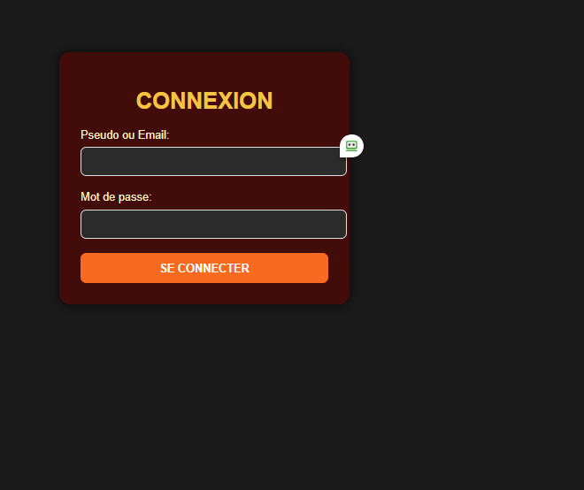
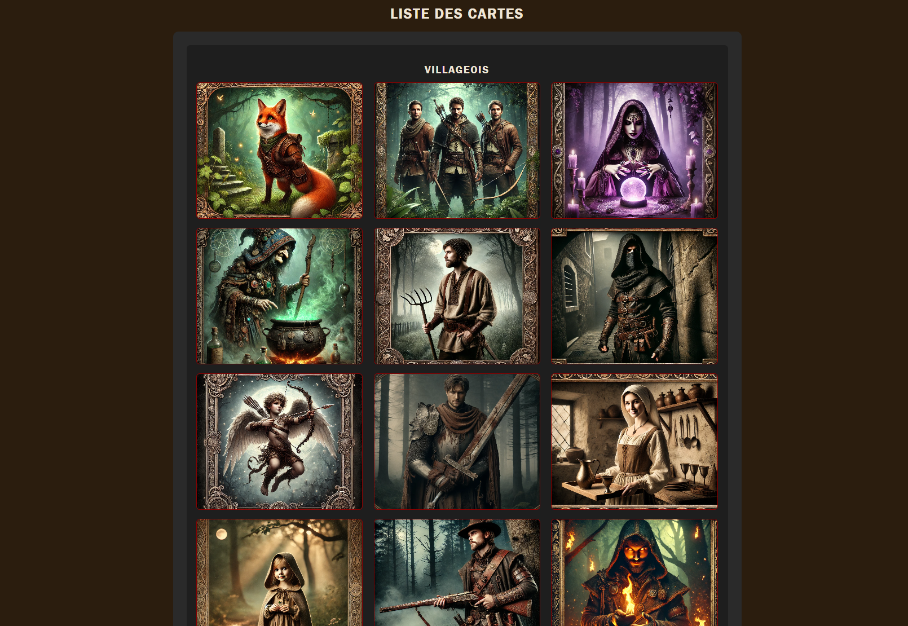
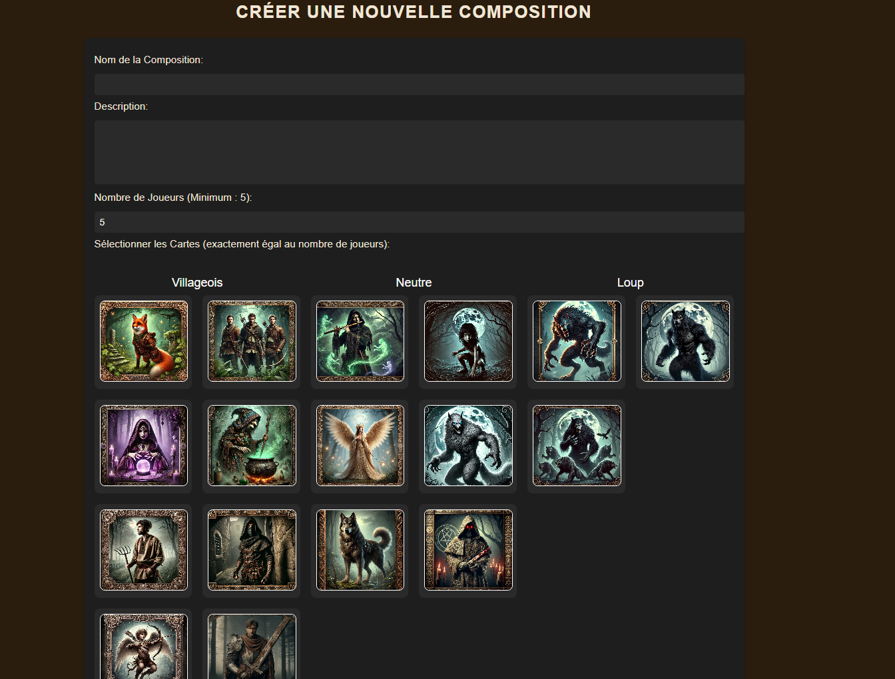
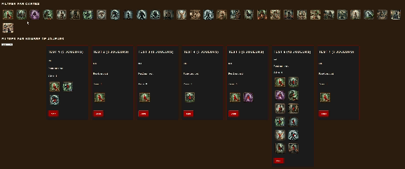

# Loup-Garou CRUD

https://loupgarou.tompascual.site:50281/

## Description

Ce projet est une application web permettant de gérer un ensemble de **compositions** et **cartes** pour le jeu de société Loup-Garou. Les utilisateurs peuvent créer des comptes, se connecter, et interagir avec les cartes et compositions de différents rôles. Le projet inclut les fonctionnalités suivantes :
- Inscription et connexion d'utilisateurs
- Gestion des cartes de rôles (Villageois, Loups-Garous, Neutres)
- Création, modification, suppression et affichage de compositions
- Like des compositions
- Filtres pour rechercher des compositions par cartes ou par nombre de joueurs
- Upload d'images pour les cartes
- Tests unitaires pour les principales fonctionnalités

## Fonctionnalités principales

### Utilisateurs
- **Inscription** : Les utilisateurs peuvent créer un compte en fournissant un pseudo, un email et un mot de passe.
- **Connexion** : Une fois inscrits, les utilisateurs peuvent se connecter avec leur pseudo ou email, et leur mot de passe.
- **Rôles d’utilisateur** : Chaque utilisateur a un rôle (par défaut "user", avec possibilité d'avoir un rôle "admin").

### Cartes
- **Affichage des cartes** : Liste des cartes disponibles, divisées en trois catégories (Villageois, Loups-Garous, Neutres).
- **Création de cartes** (admin uniquement) : Les administrateurs peuvent ajouter de nouvelles cartes avec un nom, une description, une photo, et une catégorie.
- **Modification/Suppression de cartes** (admin uniquement) : Les administrateurs peuvent modifier ou supprimer des cartes existantes.
- **Upload de photo** : Lors de la création d'une carte, une image peut être téléchargée et stockée dans le dossier `uploads`.

### Compositions
- **Création de compositions** : Les utilisateurs peuvent créer des compositions en sélectionnant des cartes parmi celles disponibles. Chaque composition a un nom, une description et un nombre de joueurs.
- **Modification/Suppression de compositions** : Les utilisateurs peuvent modifier ou supprimer leurs propres compositions, tandis que les administrateurs peuvent modifier ou supprimer toutes les compositions.
- **Likes** : Les utilisateurs peuvent aimer des compositions.
- **Filtrage des compositions** : Les utilisateurs peuvent filtrer les compositions par cartes spécifiques ou par nombre de joueurs.

### 🧪 Tests
- Tests unitaires avec **PHPUnit**
- Couverture des **modèles** : `Carte`, `Utilisateur`, `Composition`
- Couverture des **contrôleurs** : `CartesController`, `UtilisateursController`, `CompositionsController`

## Installation

### Prérequis

- **PHP** (version 7.0 ou supérieure)
- **MySQL** ou tout autre base de données compatible avec PDO
- **Composer** (facultatif, mais recommandé)
- **PHPUnit** pour exécuter les tests (si vous souhaitez les exécuter)
- **Serveur local** type Apache ou WAMP

### Étapes d'installation

1. **Clonez le dépôt :**

   ```bash
   git clone https://github.com/TomPascual/loup-garou-crud
   ```

2. **Installez les dépendances avec Composer** (si utilisé) :

   ```bash
   composer install
   ```

3. **Configuration de la base de données :**

   - Créez une base de données MySQL.
   - Importez le fichier SQL (`database.sql`) situé dans le dossier `config/` pour créer les tables nécessaires.


4. **Exécution des tests (facultatif)** :
   - Installez **PHPUnit** si vous ne l'avez pas déjà :
     ```bash
     composer require --dev phpunit/phpunit
     ```
   - Exécutez les tests dans le dossier `tests/` :
     ```bash
     ./vendor/bin/phpunit tests
     ```

5. **Accédez à l'application :**
   - Lancez votre serveur local PHP (ou utilisez un serveur comme Apache).
   - Ouvrez votre navigateur et accédez à l'application via `http://localhost/loup-garou-crud/public/index.php`.

## Arborescence du projet

```
loup-garou-crud/
├── config/
│   ├── create_tables.sql     # Script SQL pour créer les tables de la base de données
│   └── database.php          # Configuration de la base de données
├── controllers/
│   ├── cartesController.php  # Contrôleur pour gérer les cartes
│   ├── compositionsController.php # Contrôleur pour gérer les compositions
│   └── utilisateursController.php # Contrôleur pour la gestion des utilisateurs (inscription, connexion, etc.)
├── docs/                     # Documentation du projet (si applicable)
├── models/
│   ├── Carte.php             # Modèle pour les cartes
│   ├── Composition.php       # Modèle pour les compositions
│   └── Utilisateur.php       # Modèle pour les utilisateurs
├── public/
│   ├── index.php             # Point d'entrée principal de l'application
│   ├── css/                  # Dossier contenant les fichiers CSS pour le style
│   └── js/                   # Dossier contenant les fichiers JavaScript
├── tests/                    # Dossier contenant les fichiers Test
│   └── CarteTest.php
│   └── UtilisateurTest.php
│   └── CompositionTest.php
│   └── CartesControllerTest.php
│   └── UtilisateursControllerTest.php
│   └── CompositionsControllerTest.php
├── uploads/                  # Dossier pour stocker les images téléchargées
├── vendor/                   # Dépendances installées par Composer
├── views/
│   ├── cartes/               # Vues pour afficher, créer, modifier des cartes
│   ├── compositions/         # Vues pour afficher, créer, modifier des compositions
│   └── utilisateurs/         # Vues pour la connexion et l'inscription des utilisateurs
├── composer.json             # Fichier pour la gestion des dépendances avec Composer
├── composer.lock             # Verrouillage des versions des dépendances
└── README.md                 # Ce fichier
```

## Utilisation

### Créer un utilisateur

1. Allez sur la page d'inscription via le lien `Créer un compte`.
2. Remplissez le formulaire avec un pseudo, une adresse email et un mot de passe.

### Connexion

1. Connectez-vous avec votre pseudo ou email et votre mot de passe.
2. Une fois connecté, vous pouvez créer et interagir avec les compositions.
   Deux utilisateurs de base pour tester :
         -root / mdp: azerty
         -user / mdp: azerty  

### Gestion des cartes (admin)

1. En tant qu'administrateur, vous pouvez accéder à la section **Cartes** pour ajouter de nouvelles cartes.
2. Vous pouvez également modifier ou supprimer des cartes existantes.

### Création et gestion des compositions

1. Accédez à la page **Compositions**.
2. Créez une nouvelle composition en choisissant un nom, une description, un nombre de joueurs et en sélectionnant des cartes.
3. Vous pouvez également modifier vos compositions existantes ou les aimer.

## Tests

1. Les tests unitaires sont situés dans le dossier `tests/` .
2. Exécutez les tests avec PHPUnit en suivant les instructions d'installation dans la section "Installation".

### Sécurité & Maintenance 

## Sécurité :
Mots de passe hashés avec password_hash

Upload sécurisé avec move_uploaded_file

## Outils utilisés 

GLPI	Gestion de tickets, matériel, incidents IT 
Wireshark	Analyse réseau si besoin d’inspecter le trafic ou les appels
Fail2Ban	Sécurité SSH 


##  Interface du site

Voici quelques captures d’écran de l’interface du site Loup-Garou :

###  Accueil


###  Connexion


###  Affichage des cartes


###  Création d’une composition


###  Recherche d'une composition


## Auteur

- **Pascual Tom**

## License

Ce projet est sous licence MIT. 

